  

## 🌸 À propos de moi

- 👋 Je m'appelle **Chirine Hammar**, j'ai **20 ans**
- 🎓 Étudiante en **BTS SIO option SISR** (Solutions d'Infrastructure, Systèmes et Réseaux) à **MyDigitalSchool**
- 🌱 J'apprends l'administration systèmes & réseaux, la virtualisation et la cybersécurité
- 📫 Me contacter : **hammarchirine@gmail.com**

## 🌸 Compétences (en cours d'acquisition)

  

  
  
  
  
  
  
  
  
  

  <b>Réseaux</b> (TCP/IP, VLAN, routage, DHCP, DNS) · <b>Systèmes</b> (Windows Server, Linux) · <b>Virtualisation</b> · <b>Cybersécurité</b>

## 🌸 Stats GitHub

  

  

  

